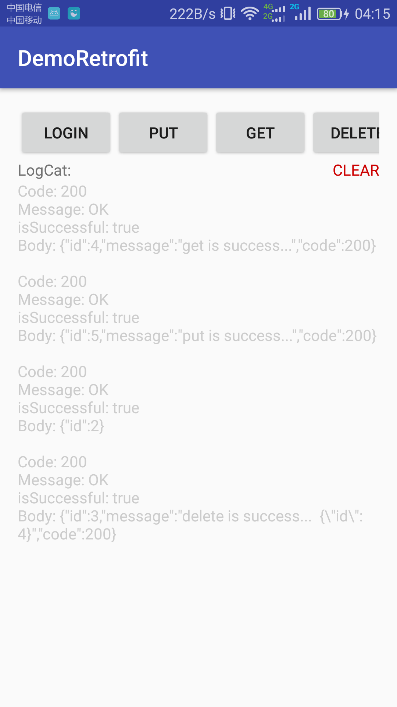

# Retrofit2.2 实践入门 Demo

---

很久前就想学习下Retrofit了，不过总是没有时间，正好最近新项目要用到网络请求，正好研究了下Retrofit2.2的简单使用方法，大致记录如下：

>Retrofit与okhttp共同出自于Square公司，retrofit就是对okhttp做了一层封装。网络请求依赖Okhttp，我们只需要通过简单的配置就能使用retrofit来进行网络请求了。

增加依赖：
```gradle
    compile 'com.squareup.retrofit2:retrofit:2.2.0'//Retrofit2所需要的包
    compile 'com.squareup.retrofit2:converter-gson:2.2.0'//ConverterFactory的Gson依赖包
```

*这里需要值得注意的是导入的retrofit2包的版本必须要一致，否则就会报错。*

这里我建立的请求地址 `baseUrl` 是 
> `http://200.200.200.182:9999/`

创建一个Retrofit对象：
```java
Retrofit retrofit = new Retrofit.Builder()
                .baseUrl("http://200.200.200.182:9999/")
                //增加返回值为Gson的支持(以实体类返回)
                .addConverterFactory(GsonConverterFactory.create())
                .build();
```

接着只需要定义对应请求的接口，用来返回一个Call对象，下面举个栗子：

假设，我需要一个登录用户的操作，服务端给我的API请求地址是：
> `http://200.200.200.182:9999/login`

请求协议是json格式，如：
```json
 {
      "username" : "admin",
      "password" : "123456"
}
```

### @POST
这里先采用`POST `请求，使用注解`@POST("login")`，有如下两种方式：

方法一：
```java
public interface RetrofitService
{
    @FormUrlEncoded
    @POST("login")
    Call<ResponseBody> login(@Field("username") String username, @Field("password") String password);
}
```

方法二：
```java
public interface RetrofitService
{
    @Headers({"Content-type:application/json"})
    @POST("login")
    Call<ResponseBody> login(@Body User user);
}

//-------------  User.java --------------------
/**
 * Created by zyao89 on 2017/2/24.
 */
public class User
{
    String username;
    String password;

    public User(String username, String password)
    {
        this.username = username;
        this.password = password;
    }

    @Override
    public String toString()
    {
        return "User{" +
                "username='" + username + '\'' +
                ", password='" + password + '\'' +
                '}';
    }
}
```


接下来我们用之前的Retrofit对象创建一个mRetrofitService接口对象，也就是我们上面定义的那个RetrofitService接口，并且得到我们的Call对象，如下：

```java
mRetrofitService = retrofit.create(RetrofitService.class);//这里采用的是Java的动态代理模式
```

接着用mRetrofitService调用我们上面定义的接口中方法，如：
```java
public void login(View view)
    {
//    方法一
        Call<ResponseBody> login = mRetrofitService.login("admin", "123456");
//    方法二
//        User user = new User("admin", "123456");
//        Call<ResponseBody> login = mRetrofitService.login(user);
        login.enqueue(getCallback());
    }
```

利用得到的Call对象，然后我们就发出网络请求了，这里介绍下`enqueue`是异步操作，`execute()`为同步操作。

```java
private Callback<ResponseBody> getCallback()
    {
        return new Callback<ResponseBody>() {
            @Override
            public void onResponse(Call<ResponseBody> call, Response<ResponseBody> response)
            {//请求成功
                printLogCat("Code: " + response.code());
                printLogCat("Message: " + response.message());
                printLogCat("isSuccessful: " + response.isSuccessful());
                try
                {
                    printLogCat("Body: " + response.body().string());
                }
                catch (IOException e)
                {
                    e.printStackTrace();
                }
                printLogCat("");
            }

            @Override
            public void onFailure(Call<ResponseBody> call, Throwable t)
            {//请求失败
                printLogCat("ERROR: " + t.getMessage());
                printLogCat("");
            }
        };
    }
```

### @GET
同样的协议，我们可以用`GET`请求来一遍，使用注解`@ GET("")`，有如下两种方式：

方式一：
```java
public interface RetrofitService
{
    @Headers({"Content-type:application/json"})
    @GET("login")
    Call<ResponseBody> login(@Query("username") String username, @Query("password") String password);
}
```

``` java
public void login(View view)
{
    Call<ResponseBody> login = mRetrofitService.login("bacdd", "333444");
    login.enqueue(getCallback());
}
```

请求URL：
>  URL: /login?username=bacdd&password=333444

方法二：
```java
public interface RetrofitService
{
    @Headers({"Content-type:application/json"})
    @GET("{url}")
    Call<ResponseBody> login(@Path("url") String url, @Query("username") String username, @Query("password") String password);
}
```

`@Path()` 为占位符，可被参数动态替换；

``` java
public void login(View view)
{
    Call<ResponseBody> login = mRetrofitService.login("login", "admin", "123444");
    login.enqueue(getCallback());
}
```

请求URL：
>  URL: /login?username= admin&password= 123444


### @DELETE  &  @PUT
用法与前两者基本相同，这里就不阐述了；
参考代码如下：
```java
    @Headers({"Content-type:application/json"})
    @PUT("put")
    Call<ResponseBody> put(@Body User user);
```

```java
    @Headers({"Content-type:application/json"})
    @HTTP(method = "DELETE", path = "/delete", hasBody = true)
    Call<ResponseBody> delete(@Body DeleteID id);
```
*备注下，Retrofit2.0以后，貌似DELETE请求是不可以带@Body参数的，所以，可改写成以上方式。*

### 总结
* @Path：所有在网址中的参数（URL的问号前面）；
* @Query：URL问号后面的参数；
* @QueryMap：相当于多个@Query ；
* @Field：用于POST请求，提交单个数据 ；（使用@Field时记得添加@FormUrlEncoded）
* @Body：相当于多个@Field，以对象的形式提交

若需要重新定义接口地址，可以使用@Url，将地址以参数的形式传入即可。如：
```java
@GET
  Call<User> getUser(@Url String url);
```


